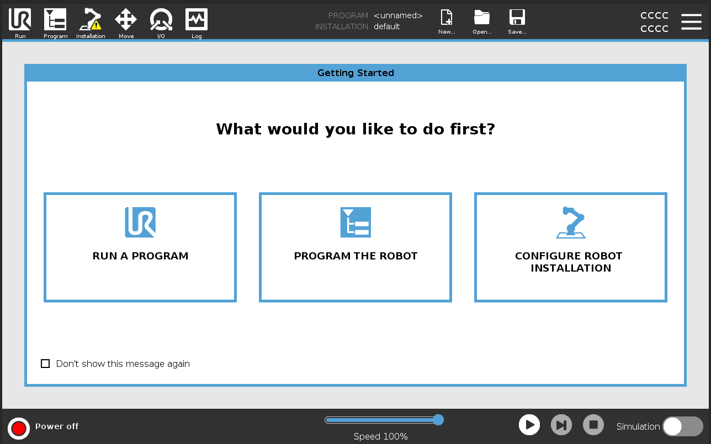
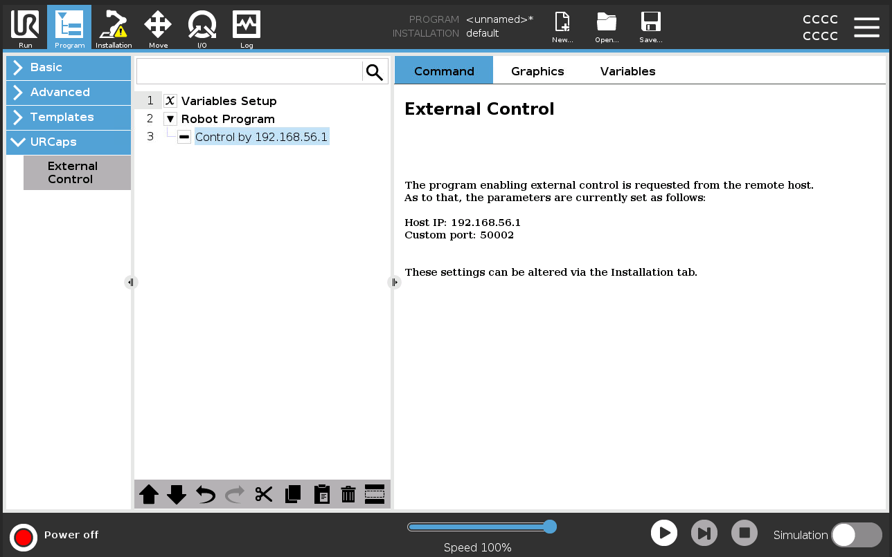
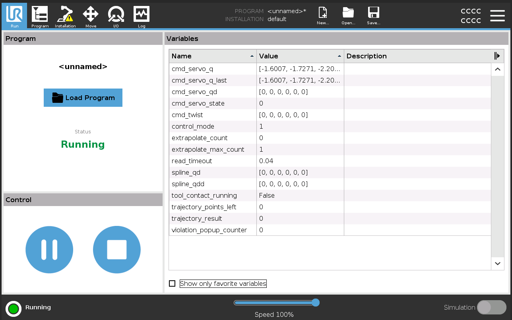

# Installation

1. Install Docker
2. Install ROS2
3. Install the ur driver
https://docs.ros.org/en/ros2_packages/humble/api/ur_robot_driver/user_docs_installation.html

    ```{bash}
    sudo apt update
    sudo apt-get install ros-humble-ur
    ```

# Launch 
## URSim
https://docs.ros.org/en/ros2_packages/humble/api/ur_robot_driver/doc/installation/ursim_docker.html
1. Source the workspace
    ```{bash}
    source /opt/ros/humble/setup.bash
    source install/setup.bash
    ```
2. Launch URSim for ur3e model
    ```{bash}
    ros2 run ur_client_library start_ursim.sh -m ur3e
    ```
## Launch the driver
3. 
    ```{bash}
    ros2 launch ur_robot_driver ur_control.launch.py ur_type:=ur3e robot_ip:=192.168.56.101    
    ```

## Enable external control URSim
4. PROGRAM THE ROBOT

5. LEFT PANEL: URcaps> External Control

6. POWER ON THE ROBOT
7. RUN THE PROGRAM


## Run simple_controller
8. 
    ```{bash}
    ros2 run ur3_rl simple_controller
    ```
9. Test the controller publishing the joint states
    ```{bash}
    ros2 topic pub /joint_trajectory_target trajectory_msgs/msg/JointTrajectory "{joint_names: ['shoulder_pan_joint', 'shoulder_lift_joint', 'elbow_joint', 'wrist_1_joint', 'wrist_2_joint', 'wrist_3_joint'], points: [{positions: [0.0, -1.57, 1.57, 0.0, 1.57, 0.0], time_from_start: {sec: 1, nanosec: 0}}]}"

    ros2 topic pub /joint_trajectory_target trajectory_msgs/msg/JointTrajectory "{joint_names: ['shoulder_pan_joint', 'shoulder_lift_joint', 'elbow_joint', 'wrist_1_joint', 'wrist_2_joint', 'wrist_3_joint'], points: [{positions: [0.0, -1.57, 1.2, 0.0, 1.57, 0.0], time_from_start: {sec: 1, nanosec: 0}}]}"
    ```

---

# Camera RealSense D435i 

https://github.com/IntelRealSense/realsense-ros/blob/ros2-master/README.md#installation-on-ubuntu

```{bash}
ros2 topic list 
/camera/camera/color/camera_info 
/camera/camera/color/image_raw 
/camera/camera/color/metadata 
/camera/camera/depth/camera_info 
/camera/camera/depth/image_rect_raw 
/camera/camera/depth/metadata 
/camera/camera/extrinsics/depth_to_color 
/camera/camera/imu 
```